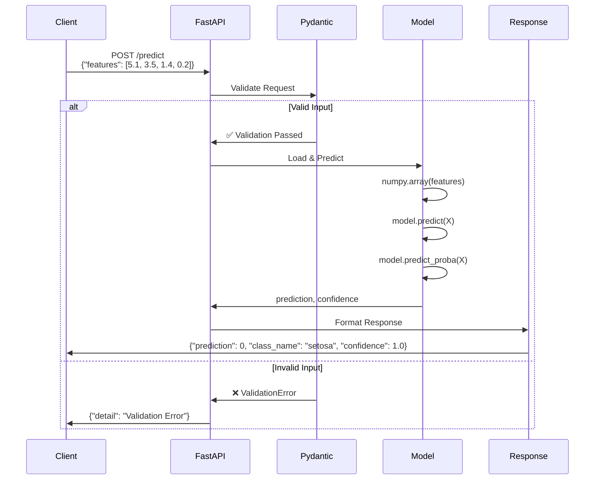
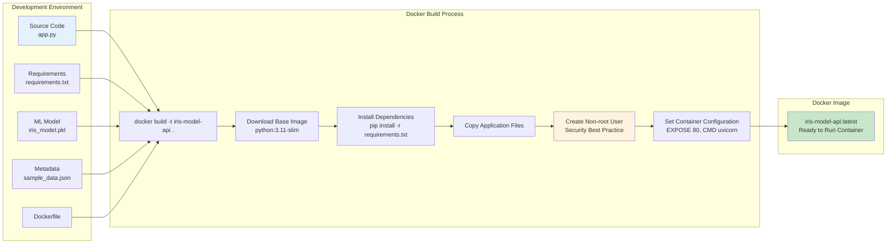
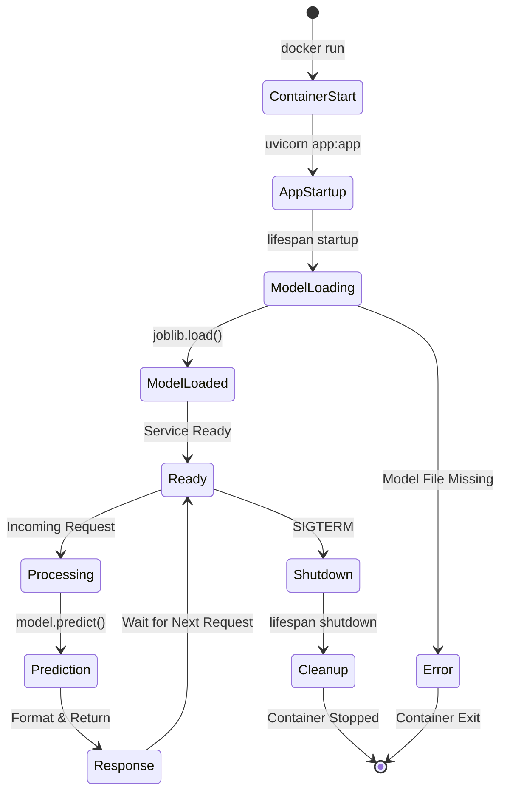
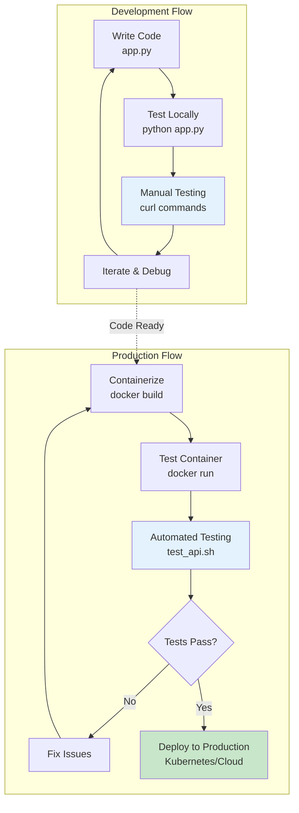
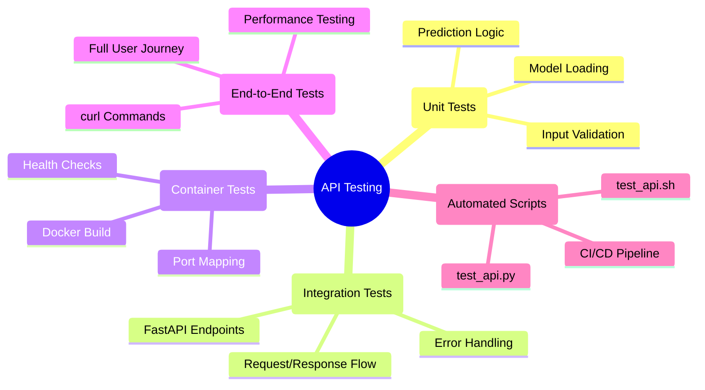

# Part 1: FastAPI + Docker - Visual Diagrams

This document contains Mermaid diagrams illustrating key concepts from Part 1 of the MLOps workshop.

## 1. FastAPI Application Architecture

```mermaid
graph TB
    subgraph "FastAPI Application"
        A[Client Request] --> B[FastAPI Router]
        B --> C{Endpoint Route}
        C -->|GET /health| D[Health Check Handler]
        C -->|POST /predict| E[Prediction Handler]
        C -->|GET /| F[Root Handler]

        E --> G[Input Validation<br/>Pydantic Models]
        G --> H[Load ML Model<br/>joblib.load()]
        H --> I[Make Prediction<br/>model.predict()]
        I --> J[Format Response<br/>PredictionResponse]
        J --> K[Return JSON]

        D --> L[Check Model Status]
        L --> M[Return Health Info]

        F --> N[API Documentation<br/>Links]
    end

    subgraph "External Dependencies"
        O[iris_model.pkl<br/>Trained Model]
        P[sample_data.json<br/>Metadata]
    end

    H -.-> O
    L -.-> P

    style A fill:#e1f5fe
    style K fill:#c8e6c9
    style O fill:#fff3e0
    style P fill:#fff3e0
```

## 2. Request-Response Flow



## 3. Docker Containerization Process



## 4. Container Runtime Architecture

```mermaid
graph TB
    subgraph "Host System"
        subgraph "Docker Container"
            A[Container OS<br/>Debian Slim]
            A --> B[Python 3.11 Runtime]
            B --> C[Uvicorn ASGI Server<br/>Port 80]
            C --> D[FastAPI Application]
            D --> E[ML Model & Logic]

            subgraph "Application Files"
                F[/app/app.py]
                G[/app/iris_model.pkl]
                H[/app/sample_data.json]
            end

            E -.-> F
            E -.-> G
            E -.-> H
        end

        subgraph "Port Mapping"
            I[Host Port 8080] <--> J[Container Port 80]
        end

        C -.-> J
    end

    subgraph "External Access"
        K[Client<br/>curl/browser] --> I
    end

    style D fill:#c8e6c9
    style E fill:#fff3e0
    style K fill:#e1f5fe
```

## 5. API Endpoint Structure

```mermaid
graph LR
    subgraph "API Endpoints"
        A[Base URL<br/>http://localhost:8080]

        A --> B[GET /<br/>Root Information]
        A --> C[GET /health<br/>Health Check]
        A --> D[POST /predict<br/>Model Prediction]
        A --> E[GET /docs<br/>Auto-generated API Docs]
    end

    subgraph "Response Types"
        B --> F[{"message": "Iris Classification API",<br/>"endpoints": {...}}]
        C --> G[{"status": "healthy",<br/>"model_loaded": true,<br/>"model_info": {...}}]
        D --> H[{"prediction": 0,<br/>"class_name": "setosa",<br/>"confidence": 1.0,<br/>"features_used": [5.1, 3.5, 1.4, 0.2]}]
        E --> I[Interactive Swagger UI<br/>API Documentation]
    end

    style A fill:#e1f5fe
    style D fill:#c8e6c9
    style H fill:#fff3e0
```

## 6. Data Flow & Validation

```mermaid
flowchart TD
    A[HTTP Request] --> B{Content-Type<br/>application/json?}
    B -->|Yes| C[Parse JSON Body]
    B -->|No| D[400 Bad Request]

    C --> E{Valid JSON?}
    E -->|No| F[422 Unprocessable Entity]
    E -->|Yes| G[Pydantic Validation]

    G --> H{features field<br/>present?}
    H -->|No| F
    H -->|Yes| I{features is<br/>list of 4 floats?}
    I -->|No| F
    I -->|Yes| J{All features<br/>non-negative?}
    J -->|No| F
    J -->|Yes| K[✅ Valid Input]

    K --> L[Convert to numpy array]
    L --> M[Model.predict()]
    M --> N[Model.predict_proba()]
    N --> O[Format Response]
    O --> P[200 OK + JSON Response]

    style K fill:#c8e6c9
    style P fill:#c8e6c9
    style D fill:#ffcdd2
    style F fill:#ffcdd2
```

## 7. Model Lifecycle in Container



## 8. Development vs Production Flow



## 9. Error Handling Strategy

```mermaid
graph TD
    A[Incoming Request] --> B{Request Valid?}
    B -->|No| C[Pydantic ValidationError]
    C --> D[422 Unprocessable Entity]

    B -->|Yes| E{Model Available?}
    E -->|No| F[Model Not Loaded Error]
    F --> G[500 Internal Server Error]

    E -->|Yes| H{Prediction Successful?}
    H -->|No| I[Prediction Error]
    I --> J[400 Bad Request]

    H -->|Yes| K[Successful Response]
    K --> L[200 OK + JSON]

    subgraph "Error Response Format"
        M[{"detail": "Error description",<br/>"type": "validation_error"}]
    end

    D --> M
    G --> M
    J --> M

    style K fill:#c8e6c9
    style L fill:#c8e6c9
    style D fill:#ffcdd2
    style G fill:#ffcdd2
    style J fill:#ffcdd2
```

## 10. Testing Strategy Overview



---

## How to Use These Diagrams

1. **Copy the Mermaid code** from any diagram above
2. **Paste into your preferred tool:**
   - GitHub/GitLab (native support)
   - Mermaid Live Editor (https://mermaid.live/)
   - VS Code with Mermaid extension
   - Notion, Obsidian, or other markdown tools

3. **Customize as needed** for your specific use case

These diagrams help visualize the concepts that students experience hands-on in Part 1 of the workshop!