# Part 2: Kubernetes Deployment - Visual Diagrams

This document contains Mermaid diagrams illustrating key concepts from Part 2 of the MLOps workshop.

## 1. Kubernetes Architecture Overview

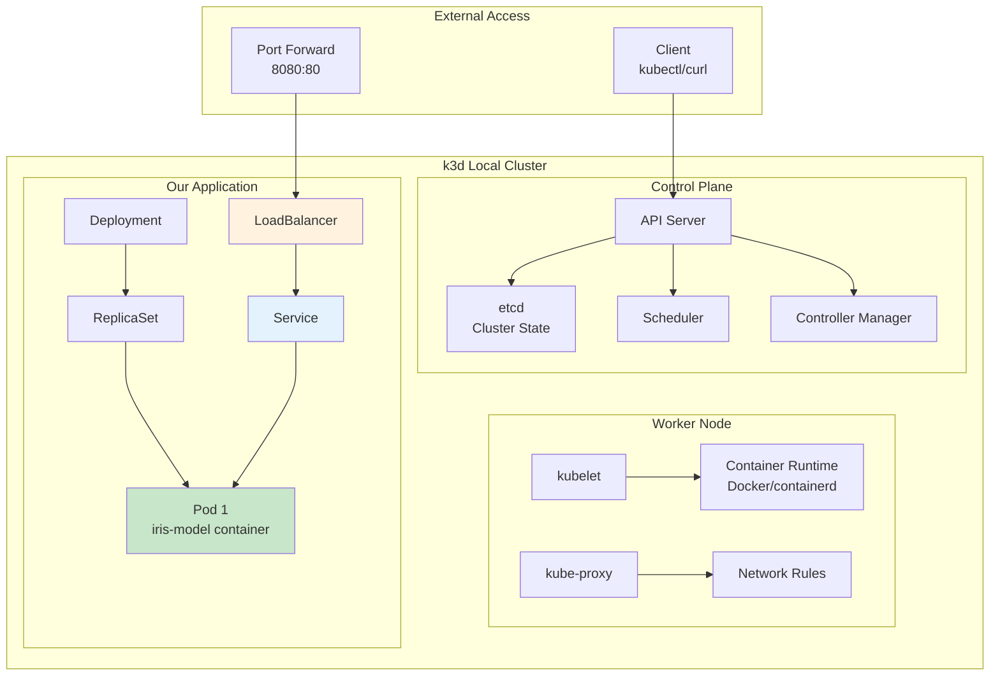

## 2. Pod Lifecycle and Management

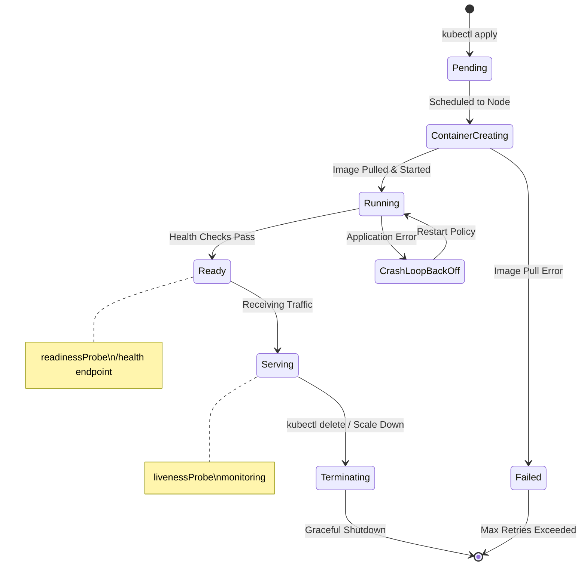

## 3. Deployment Resource Hierarchy

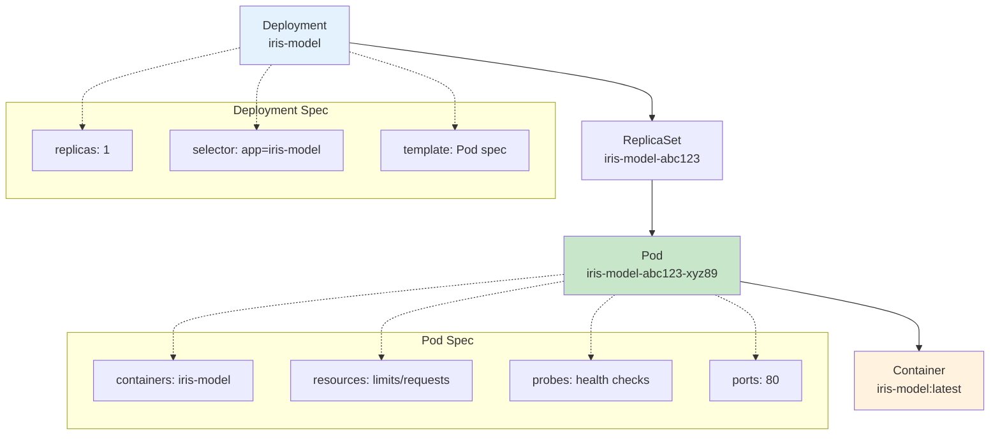

## 4. Service Discovery and Networking

```mermaid
graph LR
    subgraph "Client"
        A[kubectl port-forward<br/>localhost:8080]
    end

    subgraph "k3d Cluster Network"
        B[Service<br/>iris-model-service<br/>ClusterIP: 10.43.x.x]

        subgraph "Endpoints"
            C[Pod 1<br/>10.42.0.x:80]
            D[Pod 2<br/>10.42.0.y:80<br/>(if scaled)]
        end

        subgraph "Service Types"
            E[LoadBalancer<br/>External Access]
            F[ClusterIP<br/>Internal Only]
            G[NodePort<br/>Node IP + Port]
        end
    end

    A --> B
    B --> C
    B --> D
    B -.-> E
    B -.-> F
    B -.-> G

    style B fill:#e3f2fd
    style C fill:#c8e6c9
    style D fill:#c8e6c9
```

## 5. kubectl Command Flow

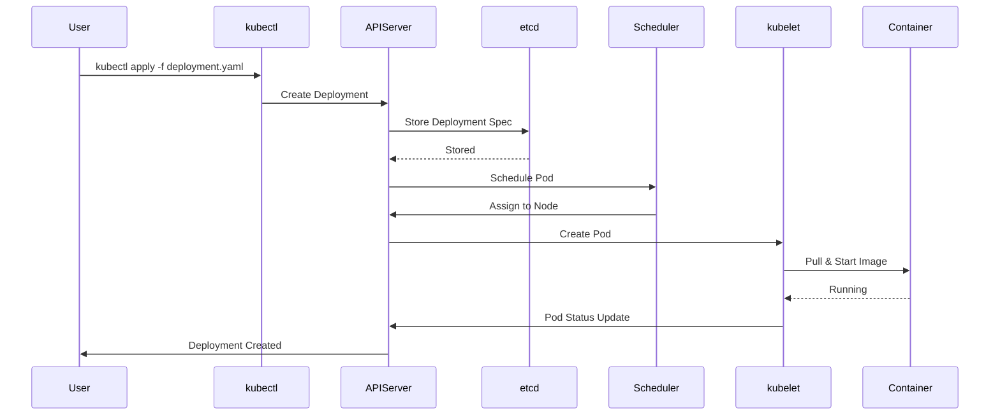

## 6. Health Check Configuration

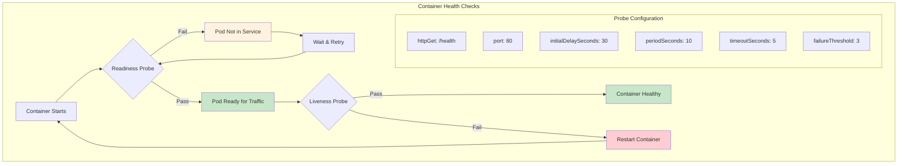

## 7. Resource Management

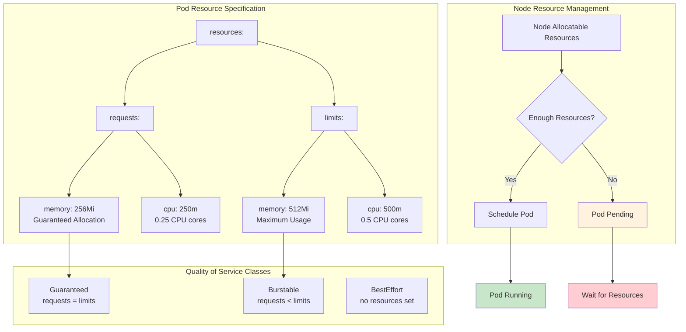

## 8. Scaling and Load Balancing

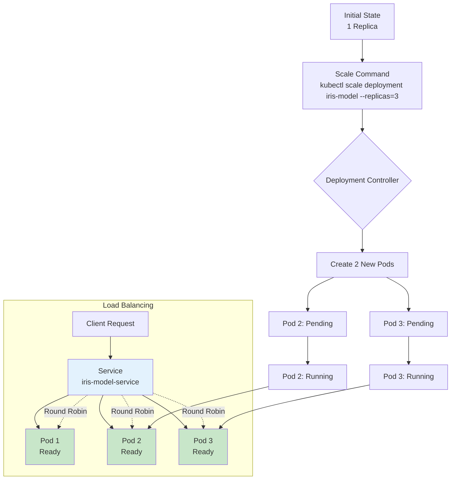

## 9. YAML Manifest Structure

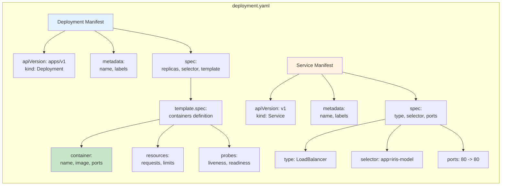

## 10. Troubleshooting Decision Tree

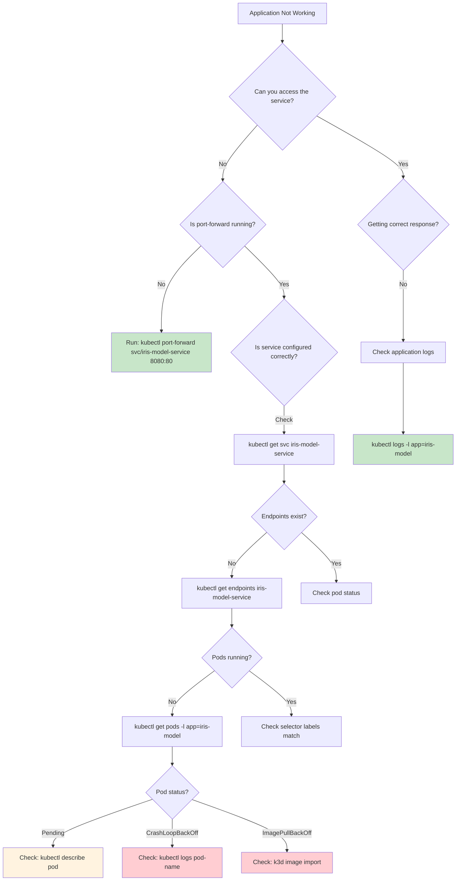

## 11. k3d Cluster Lifecycle

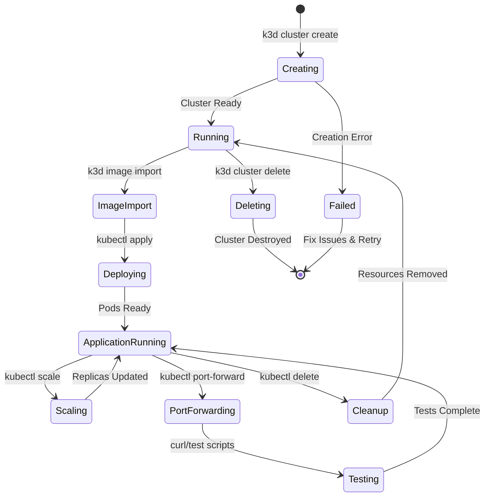

## 12. Container to Kubernetes Migration

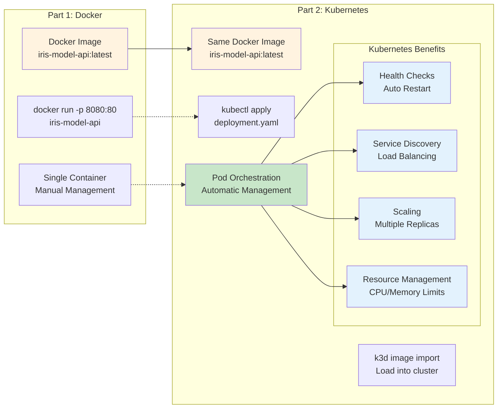

## 13. Network Traffic Flow

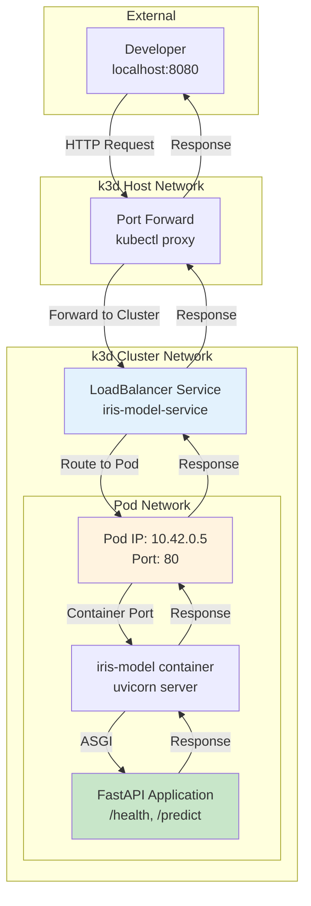

## 14. Kubernetes vs Docker Comparison

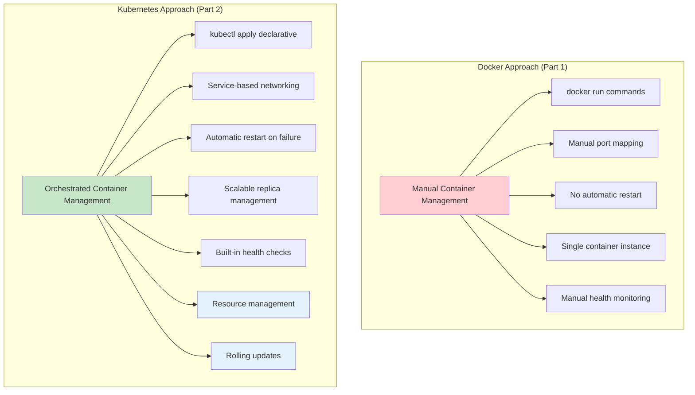

## 15. Complete Deployment Workflow

```mermaid
flowchart TD
    A[Start: Docker image ready] --> B[Create k3d cluster]
    B --> C[Import Docker image to cluster]
    C --> D[Apply deployment.yaml]
    D --> E[Wait for pods to be ready]

    E --> F{Pods healthy?}
    F -->|No| G[Check logs & debug]
    G --> H[Fix issues]
    H --> D

    F -->|Yes| I[Start port-forward]
    I --> J[Test health endpoint]
    J --> K[Test prediction endpoint]
    K --> L[Run comprehensive tests]

    L --> M{All tests pass?}
    M -->|No| G
    M -->|Yes| N[✅ Deployment successful]

    N --> O[Optional: Scale deployment]
    O --> P[Monitor and maintain]

    P --> Q[When done: Clean up]
    Q --> R[kubectl delete resources]
    R --> S[k3d cluster delete]

    style N fill:#c8e6c9
    style B fill:#e3f2fd
    style G fill:#fff3e0
    style S fill:#ffcdd2
```

---

## How to Use These Diagrams

1. **Copy the Mermaid code** from any diagram above
2. **Paste into your preferred tool:**
   - GitHub/GitLab (native support)
   - Mermaid Live Editor (https://mermaid.live/)
   - VS Code with Mermaid extension
   - Notion, Obsidian, or other markdown tools

3. **Use for teaching:**
   - Show before hands-on exercises
   - Reference during troubleshooting
   - Explain complex Kubernetes concepts visually

These diagrams complement the hands-on Kubernetes experience in Part 2, helping students understand the orchestration concepts they're implementing!
