# Part 3: Cloud Deployment - Visual Diagram

This document contains a comprehensive Mermaid diagram illustrating the key concepts from Part 3 of the MLOps workshop.

## Multi-Cloud Kubernetes Deployment Architecture

```mermaid
graph TB
    subgraph "Development Environment"
        A[Local Docker Image<br/>iris-model-api:latest]
        B[Kubernetes Manifests<br/>deployment-*.yaml]
        C[Cloud CLI Tools<br/>gcloud/aws/az]
    end

    subgraph "Google Cloud Platform (GKE)"
        subgraph "Container Registry"
            D1[gcr.io/PROJECT/iris-model-api]
        end
        subgraph "Google Kubernetes Engine"
            E1[GKE Control Plane<br/>Managed by Google]
            F1[Node Pool<br/>e2-medium instances]
            G1[LoadBalancer Service<br/>External IP]
            H1[Horizontal Pod Autoscaler<br/>2-10 replicas]
        end
    end

    subgraph "Amazon Web Services (EKS)"
        subgraph "Elastic Container Registry"
            D2[ACCOUNT.dkr.ecr.region.amazonaws.com/<br/>iris-model-api]
        end
        subgraph "Elastic Kubernetes Service"
            E2[EKS Control Plane<br/>Managed by AWS]
            F2[Node Group<br/>t3.medium instances]
            G2[Network Load Balancer<br/>External endpoint]
            H2[Horizontal Pod Autoscaler<br/>2-10 replicas]
        end
    end

    subgraph "Microsoft Azure (AKS)"
        subgraph "Azure Container Registry"
            D3[acr.azurecr.io/iris-model-api]
        end
        subgraph "Azure Kubernetes Service"
            E3[AKS Control Plane<br/>Managed by Microsoft]
            F3[Virtual Machine Scale Set<br/>Standard_B2s instances]
            G3[Azure LoadBalancer<br/>Public IP]
            H3[Horizontal Pod Autoscaler<br/>2-10 replicas]
        end
    end

    subgraph "Production Considerations"
        I[Security<br/>• RBAC<br/>• Network Policies<br/>• Secrets Management]
        J[Monitoring<br/>• Container Insights<br/>• Application Monitoring<br/>• Resource Usage]
        K[Scaling<br/>• HPA: CPU/Memory<br/>• VPA: Right-sizing<br/>• Cluster Autoscaling]
        L[Cost Optimization<br/>• Spot/Preemptible Nodes<br/>• Resource Limits<br/>• Auto-shutdown]
    end

    subgraph "Deployment Process"
        M[1. Create Cluster] --> N[2. Push to Registry]
        N --> O[3. Apply Manifests]
        O --> P[4. Configure Networking]
        P --> Q[5. Set up Monitoring]
        Q --> R[6. Test & Validate]
    end

    subgraph "Common Challenges & Solutions"
        S[Image Pull Secrets<br/>Authentication to private registry]
        T[External IP Assignment<br/>LoadBalancer provisioning time]
        U[Resource Quotas<br/>Cloud provider limits]
        V[Network Security<br/>Firewall rules & ingress]
        W[Cost Management<br/>Always-on cluster expenses]
    end

    %% Connections
    A --> D1
    A --> D2
    A --> D3
    B --> O
    C --> M

    D1 --> E1
    D2 --> E2
    D3 --> E3

    E1 --> F1
    E2 --> F2
    E3 --> F3

    F1 --> G1
    F2 --> G2
    F3 --> G3

    G1 --> H1
    G2 --> H2
    G3 --> H3

    H1 -.-> K
    H2 -.-> K
    H3 -.-> K

    E1 -.-> I
    E2 -.-> I
    E3 -.-> I

    F1 -.-> J
    F2 -.-> J
    F3 -.-> J

    G1 -.-> L
    G2 -.-> L
    G3 -.-> L

    R -.-> S
    R -.-> T
    R -.-> U
    R -.-> V
    R -.-> W

    %% Styling
    style A fill:#fff3e0
    style E1 fill:#4285f4,color:#fff
    style E2 fill:#ff9900,color:#fff
    style E3 fill:#0078d4,color:#fff
    style G1 fill:#c8e6c9
    style G2 fill:#c8e6c9
    style G3 fill:#c8e6c9
    style I fill:#ffcdd2
    style J fill:#e1f5fe
    style K fill:#f3e5f5
    style L fill:#e8f5e8
    style S fill:#fff3e0
    style T fill:#fff3e0
    style U fill:#fff3e0
    style V fill:#fff3e0
    style W fill:#fff3e0

    %% Labels for clarity
    classDef gcp fill:#4285f4,color:#fff
    classDef aws fill:#ff9900,color:#fff
    classDef azure fill:#0078d4,color:#fff
    classDef success fill:#c8e6c9
    classDef warning fill:#fff3e0
    classDef security fill:#ffcdd2
    classDef monitoring fill:#e1f5fe
    classDef scaling fill:#f3e5f5
    classDef cost fill:#e8f5e8

    class D1,E1,F1,G1,H1 gcp
    class D2,E2,F2,G2,H2 aws
    class D3,E3,F3,G3,H3 azure
    class G1,G2,G3 success
    class S,T,U,V,W warning
    class I security
    class J monitoring
    class K scaling
    class L cost
```

---

## Key Concepts Illustrated

### **Multi-Cloud Strategy**
- **Same Application**: Deploy identical workload across GCP, AWS, and Azure
- **Provider-Specific**: Each cloud has different services (GKE/EKS/AKS, GCR/ECR/ACR)
- **Consistent Process**: Similar deployment workflow despite provider differences

### **Managed Kubernetes Benefits**
- **Control Plane**: Fully managed by cloud provider (no master node maintenance)
- **Scaling**: Built-in auto-scaling capabilities at multiple levels
- **Integration**: Native integration with cloud services (monitoring, networking, security)

### **Production Considerations**
- **Security**: RBAC, network policies, secrets management
- **Monitoring**: Container insights, application performance monitoring
- **Scaling**: Horizontal Pod Autoscaler, Vertical Pod Autoscaler, cluster autoscaling
- **Cost**: Resource optimization, spot instances, auto-shutdown policies

### **Common Challenges**
- **Authentication**: Container registry access and image pull secrets
- **Networking**: Load balancer provisioning and external IP assignment
- **Limits**: Cloud provider quotas and resource constraints
- **Security**: Network policies and firewall configurations
- **Cost**: Always-on infrastructure expenses

### **Deployment Flow**
1. **Create Cluster** → Provision managed Kubernetes service
2. **Push to Registry** → Upload container image to cloud registry
3. **Apply Manifests** → Deploy application using kubectl
4. **Configure Networking** → Set up load balancers and ingress
5. **Set up Monitoring** → Enable logging and metrics collection
6. **Test & Validate** → Verify deployment and performance

---

## How to Use This Diagram

1. **Copy the Mermaid code** above
2. **Paste into your preferred tool:**
   - GitHub/GitLab (native support)
   - Mermaid Live Editor (https://mermaid.live/)
   - VS Code with Mermaid extension
   - Notion, Obsidian, or other markdown tools

3. **Use for teaching:**
   - Show before cloud deployment exercises
   - Compare different cloud providers
   - Explain production considerations
   - Illustrate common challenges and solutions

This diagram helps students understand the complexity and considerations involved in production cloud deployments, setting up the contrast with the simplicity they'll experience in Part 4 (Modal)!
