# Part 4: Modal Serverless Deployment - Visual Diagrams

This document contains Mermaid diagrams illustrating the revolutionary simplification that Modal brings to ML deployment.

## 1. The Great Simplification: Before vs After

```mermaid
graph TD
    subgraph "Traditional Approach (Parts 1-3)"
        subgraph "Files & Configuration"
            A1[app.py<br/>FastAPI application]
            A2[Dockerfile<br/>Container config]
            A3[requirements.txt<br/>Dependencies]
            A4[deployment.yaml<br/>K8s manifests]
            A5[service.yaml<br/>Networking config]
            A6[test scripts<br/>Multiple files]
            A7[Cloud configs<br/>Registry setup]
        end

        subgraph "Infrastructure Components"
            B1[Docker Registry]
            B2[Container Runtime]
            B3[Kubernetes Cluster]
            B4[Load Balancer]
            B5[Auto Scaler]
            B6[Monitoring Stack]
            B7[Security Policies]
        end

        subgraph "Operational Overhead"
            C1[Cluster Management]
            C2[Image Updates]
            C3[Health Monitoring]
            C4[Resource Tuning]
            C5[Security Updates]
            C6[Cost Optimization]
            C7[Troubleshooting]
        end
    end

    subgraph "Modal Approach (Part 4)"
        subgraph "Single File"
            D1[app_modal.py<br/>~20 lines total]
        end

        subgraph "Automatic Infrastructure"
            E1[🚀 Auto Containerization]
            E2[🌐 Global Deployment]
            E3[📈 Auto Scaling to Zero]
            E4[🔒 Built-in Security]
            E5[📊 Integrated Monitoring]
            E6[💰 Pay-per-Request]
            E7[⚡ Sub-second Cold Start]
        end

        subgraph "Zero Operational Overhead"
            F1[✅ Fully Managed]
            F2[✅ Auto Updates]
            F3[✅ Built-in Observability]
            F4[✅ Automatic Optimization]
            F5[✅ Security Handled]
            F6[✅ Cost Optimized]
            F7[✅ Self Healing]
        end
    end

    %% Connections showing elimination
    A1 -.->|Replaced by| D1
    A2 -.->|Eliminated| E1
    A3 -.->|Eliminated| E1
    A4 -.->|Eliminated| E2
    A5 -.->|Eliminated| E2
    A6 -.->|Simplified| D1
    A7 -.->|Eliminated| E2

    B1 -.->|Abstracted| E1
    B2 -.->|Abstracted| E1
    B3 -.->|Abstracted| E2
    B4 -.->|Abstracted| E2
    B5 -.->|Built-in| E3
    B6 -.->|Built-in| E5
    B7 -.->|Built-in| E4

    C1 -.->|Eliminated| F1
    C2 -.->|Eliminated| F2
    C3 -.->|Eliminated| F3
    C4 -.->|Eliminated| F4
    C5 -.->|Eliminated| F5
    C6 -.->|Eliminated| F6
    C7 -.->|Eliminated| F7

    %% Styling
    style D1 fill:#c8e6c9,stroke:#4caf50,stroke-width:3px
    style E1 fill:#e3f2fd,color:#1976d2
    style E2 fill:#e3f2fd,color:#1976d2
    style E3 fill:#e3f2fd,color:#1976d2
    style E4 fill:#e3f2fd,color:#1976d2
    style E5 fill:#e3f2fd,color:#1976d2
    style E6 fill:#e3f2fd,color:#1976d2
    style E7 fill:#e3f2fd,color:#1976d2
    style F1 fill:#e8f5e8,color:#2e7d32
    style F2 fill:#e8f5e8,color:#2e7d32
    style F3 fill:#e8f5e8,color:#2e7d32
    style F4 fill:#e8f5e8,color:#2e7d32
    style F5 fill:#e8f5e8,color:#2e7d32
    style F6 fill:#e8f5e8,color:#2e7d32
    style F7 fill:#e8f5e8,color:#2e7d32
    style A1 fill:#ffebee
    style A2 fill:#ffebee
    style A3 fill:#ffebee
    style A4 fill:#ffebee
    style A5 fill:#ffebee
    style A6 fill:#ffebee
    style A7 fill:#ffebee
```



## 2. Modal Function Lifecycle


## 3. Modal vs Traditional Architecture Comparison

```mermaid
graph TB
    subgraph "Traditional Stack Complexity"
        subgraph "Layer 7: Application"
            T7[FastAPI Code<br/>Error Handling<br/>Validation Logic]
        end
        subgraph "Layer 6: Container"
            T6[Docker Image<br/>Base OS<br/>Dependencies<br/>Security Config]
        end
        subgraph "Layer 5: Orchestration"
            T5[Kubernetes<br/>Deployments<br/>Services<br/>ConfigMaps]
        end
        subgraph "Layer 4: Infrastructure"
            T4[Cloud Provider<br/>VMs/Nodes<br/>Networking<br/>Storage]
        end
        subgraph "Layer 3: Platform Services"
            T3[Load Balancers<br/>Auto Scalers<br/>Monitoring<br/>Logging]
        end
        subgraph "Layer 2: Security & Compliance"
            T2[RBAC<br/>Network Policies<br/>Secrets Management<br/>Compliance]
        end
        subgraph "Layer 1: Operations"
            T1[CI/CD<br/>Monitoring<br/>Alerting<br/>Maintenance]
        end
    end

    subgraph "Modal Serverless Simplicity"
        subgraph "Your Code Only"
            M1[Python Function<br/>@app.function<br/>Business Logic Only]
        end
        subgraph "Modal Platform (Abstracted)"
            M2[🌟 Everything Else<br/>Handled Automatically]

            subgraph "Auto-Managed Infrastructure"
                M3[Container Management ✅<br/>Orchestration ✅<br/>Scaling ✅<br/>Networking ✅<br/>Security ✅<br/>Monitoring ✅<br/>Operations ✅]
            end
        end
    end

    %% Show what's eliminated
    T7 -.->|Simplified to| M1
    T6 -.->|Abstracted by| M2
    T5 -.->|Abstracted by| M2
    T4 -.->|Abstracted by| M2
    T3 -.->|Abstracted by| M2
    T2 -.->|Abstracted by| M2
    T1 -.->|Abstracted by| M2

    M1 --> M2
    M2 --> M3

    %% Styling
    style M1 fill:#c8e6c9,stroke:#4caf50,stroke-width:3px
    style M2 fill:#e3f2fd,stroke:#2196f3,stroke-width:2px
    style M3 fill:#f3e5f5,stroke:#9c27b0,stroke-width:2px
    style T7 fill:#fff3e0
    style T6 fill:#ffebee
    style T5 fill:#ffebee
    style T4 fill:#ffebee
    style T3 fill:#ffebee
    style T2 fill:#ffebee
    style T1 fill:#ffebee
```



## 4. Modal Request Flow & Auto-Scaling


## 5. Cost & Performance Comparison


## 6. Code Evolution: From Complex to Simple

```mermaid
flowchart TD
    subgraph "Part 1: FastAPI (40+ lines)"
        A1[from fastapi import FastAPI<br/>from pydantic import BaseModel<br/>import joblib, numpy as np<br/>import uvicorn]
        A2[app = FastAPI&#40;&#41;<br/>model = joblib.load&#40;&#41;<br/>class PredictionRequest&#40;BaseModel&#41;]
        A3[@app.post&#40;"/predict"&#41;<br/>def predict&#40;request&#41;:<br/>    # validation logic<br/>    # error handling<br/>    # response formatting]
        A4[if __name__ == "__main__":<br/>    uvicorn.run&#40;app&#41;]
    end

    subgraph "Part 2: + Dockerfile (15+ lines)"
        B1[FROM python:3.11-slim<br/>WORKDIR /app<br/>COPY requirements.txt .]
        B2[RUN pip install -r requirements.txt<br/>COPY . .<br/>RUN useradd appuser]
        B3[USER appuser<br/>EXPOSE 80<br/>CMD uvicorn app:app]
    end

    subgraph "Part 3: + Kubernetes YAML (50+ lines)"
        C1[apiVersion: apps/v1<br/>kind: Deployment<br/>metadata: ...]
        C2[spec:<br/>  replicas: 2<br/>  selector: ...<br/>  template: ...]
        C3[containers:<br/>  - name: iris-model<br/>    image: ...<br/>    resources: ...]
        C4[---<br/>apiVersion: v1<br/>kind: Service<br/>spec: ...]
    end

    subgraph "Part 4: Modal (20 lines total!)"
        D1[import modal<br/>app = modal.App&#40;"iris-classifier"&#41;]
        D2[@app.function&#40;<br/>  image=modal.Image.debian_slim&#40;&#41;.pip_install&#40;..&#41;,<br/>  mounts=[modal.Mount.from_local_file&#40;..&#41;]<br/>&#41;]
        D3[@modal.web_endpoint&#40;method="POST"&#41;<br/>def predict&#40;item: dict&#41;:<br/>    import joblib, numpy as np<br/>    # Simple prediction logic<br/>    return result]
        D4[# That's it! 🎉<br/># Deploy with: modal deploy app.py]
    end

    A1 --> A2 --> A3 --> A4
    A4 --> B1
    B1 --> B2 --> B3
    B3 --> C1
    C1 --> C2 --> C3 --> C4
    C4 -.->|Replaces Everything Above| D1
    D1 --> D2 --> D3 --> D4

    %% Styling to show progression and final simplification
    style A1 fill:#ffebee
    style A2 fill:#ffebee
    style A3 fill:#ffebee
    style A4 fill:#ffebee
    style B1 fill:#fff3e0
    style B2 fill:#fff3e0
    style B3 fill:#fff3e0
    style C1 fill:#e8eaf6
    style C2 fill:#e8eaf6
    style C3 fill:#e8eaf6
    style C4 fill:#e8eaf6
    style D1 fill:#c8e6c9,stroke:#4caf50,stroke-width:3px
    style D2 fill:#c8e6c9,stroke:#4caf50,stroke-width:3px
    style D3 fill:#c8e6c9,stroke:#4caf50,stroke-width:3px
    style D4 fill:#c8e6c9,stroke:#4caf50,stroke-width:3px
```

## 7. Feature Completeness Matrix

```mermaid
graph TB
    subgraph "Required ML Deployment Features"
        F1[Model Serving ✅]
        F2[HTTP API ✅]
        F3[Auto Scaling ✅]
        F4[Load Balancing ✅]
        F5[Health Checks ✅]
        F6[Error Handling ✅]
        F7[Monitoring ✅]
        F8[Security ✅]
        F9[Global Deployment ✅]
        F10[Cost Optimization ✅]
    end

    subgraph "Traditional Implementation"
        T1[FastAPI Code: 40+ lines]
        T2[Kubernetes YAML: 50+ lines]
        T3[Dockerfile: 15+ lines]
        T4[Test Scripts: 30+ lines]
        T5[Monitoring Setup: Complex]
        T6[Security Config: RBAC, policies]
        T7[Cloud Setup: Multiple services]
        T8[CI/CD Pipeline: Additional complexity]

        subgraph "Total Traditional Effort"
            T9[📁 8+ files<br/>📝 200+ lines of code<br/>⏱️ Hours of configuration<br/>🔧 Ongoing maintenance]
        end
    end

    subgraph "Modal Implementation"
        M1[Single Python File: 20 lines]
        M2[Zero Configuration Files]
        M3[Auto Infrastructure]
        M4[Built-in Everything]

        subgraph "Total Modal Effort"
            M5[📁 1 file<br/>📝 20 lines of code<br/>⏱️ 2 minutes deployment<br/>🚀 Zero maintenance]
        end
    end

    %% Feature completeness connections
    F1 --> T1
    F1 --> M1
    F2 --> T1
    F2 --> M1
    F3 --> T2
    F3 --> M3
    F4 --> T2
    F4 --> M3
    F5 --> T1
    F5 --> M4
    F6 --> T1
    F6 --> M4
    F7 --> T5
    F7 --> M4
    F8 --> T6
    F8 --> M4
    F9 --> T7
    F9 --> M3
    F10 --> T8
    F10 --> M3

    T1 --> T9
    T2 --> T9
    T3 --> T9
    T4 --> T9
    T5 --> T9
    T6 --> T9
    T7 --> T9
    T8 --> T9

    M1 --> M5
    M2 --> M5
    M3 --> M5
    M4 --> M5

    %% Styling
    style M5 fill:#c8e6c9,stroke:#4caf50,stroke-width:4px
    style T9 fill:#ffcdd2,stroke:#d32f2f,stroke-width:2px
    style M1 fill:#e8f5e8
    style M2 fill:#e8f5e8
    style M3 fill:#e8f5e8
    style M4 fill:#e8f5e8
```



---

## How to Use These Diagrams

1. **Copy the Mermaid code** from any diagram above
2. **Paste into your preferred tool:**
   - GitHub/GitLab (native support)
   - Mermaid Live Editor (https://mermaid.live/)
   - VS Code with Mermaid extension
   - Notion, Obsidian, or other markdown tools

3. **Perfect for the "big reveal":**
   - Show diagram #1 after students complete Parts 1-3
   - Use diagram #6 to demonstrate code evolution
   - Reference diagram #3 to explain architectural simplification
   - Use diagram #5 for cost/performance discussions

## Key Teaching Moments

- **After Part 3 completion**: Show "The Great Simplification" to demonstrate what Modal eliminates
- **During Modal demo**: Use the "Code Evolution" diagram to show the journey from 200+ lines to 20 lines
- **For decision-making**: Reference the "Feature Completeness Matrix" to show Modal delivers everything with minimal effort
- **For business case**: Use "Cost & Performance Comparison" to justify serverless adoption

These diagrams perfectly capture the "wow factor" that students experience when they see how Modal replaces all the complexity from Parts 1-3!
